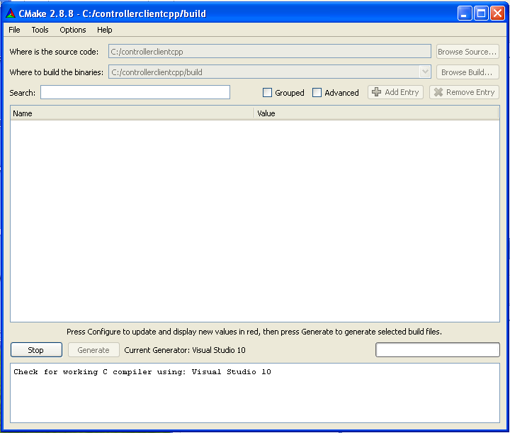

MUJIN Controller C++ Client Library
-----------------------------------

This is an open-source client library communicating with the MUJIN Controller WebAPI.

Uses  for communication. `C Bindings <http://curl.haxx.se/libcurl/c/>`_ and `C++ Bindings <http://www.curlpp.org>`_

In the following documentation %MUJINCLIENTGIT% means the root directory where the sources are checked out.

Running on Windows
------------------

Need to put the following folder in the PATH environment variable::

  %MUJINCLIENTGIT%\msvc_binaries\vcXX\bin

Building on Windows
-------------------

1. Checkout the source code and install
 - Download and install `msysGit <http://code.google.com/p/msysgit/downloads/list?q=full+installer+official+git>`_
 - (Optional for nice graphical interface) Download and install  `TortoiseGit <http://code.google.com/p/tortoisegit/wiki/Download>`_ 
 - Checkout the following git repository **https://github.com/mujin/controllerclientcpp.git**

2. Download and install `CMake <http://www.cmake.org/cmake/resources/software.html>`_ (>= v2.8.10)

3. Run CMake on this directory, choose the correct Visual Studio version for the Generator.

4. Open the **build/mujincontrollerclientcpp.sln** solution and compile the **ALL_BUILD** project.

5. In order to Install into ``c:\Program Files``, compile the **INSTALL** project

Building OpenSSL
================

If OpenSSL libraries do not exist for the specific Visual Studio version

- Download and Install `Starberry Perl <http://strawberryperl.com/>`_

- Download and Install `NASM <http://sourceforge.net/projects/nasm/files/Win32%20binaries/2.07/nasm-2.07-installer.exe/download>`_

 - add ``C:\Program Files\NASM`` to the **PATH** variable.

- uncompress **openssl-1.0.1c.tar.gz**.

- Open the Visual Studio Command Prompt, cd into ``openssl-1.0.1c``, set the XX depending on the VC++ version, and run::

  perl Configure VC-WIN32 --prefix=%MUJINCLIENTGIT%\msvc_binaries\vcXX
  ms\do_nasm
  nmake -f ms\ntdll.mak
  nmake -f ms\ntdll.mak install

- The final binaries should be in the ``msvc_binaries\vcXX\lib`` folder.

Building libcurl
================

Patch lib/CMakeLists.txt:122 with::

  set_target_properties(${LIB_NAME} PROPERTIES IMPORT_SUFFIX "_imp.lib" OUTPUT_NAME "libcurl-vc100-mt")

and line 126 with::

  if(WIN32 AND NOT CURL_STATICLIB)
    install(TARGETS ${LIB_NAME} RUNTIME DESTINATION bin LIBRARY DESTINATION bin ARCHIVE DESTINATION lib)
  else(WIN32 AND NOT CURL_STATICLIB)
    install(TARGETS ${LIB_NAME} DESTINATION lib)
  endif()

Make the visual studio project with the following command::

  mkdir buildvc100
  cd buildvc100
  cmake -DOPENSSL_ROOT_DIR=%MUJINCLIENTGIT%\msvc_binaries\vcXX -DCMAKE_REQUIRED_INCLUDES=%MUJINCLIENTGIT%\msvc_binaries\vcXX\include -DBUILD_CURL_TESTS=OFF -DCURL_USE_ARES=OFF -DCURL_STATICLIB=OFF -DCMAKE_INSTALL_PREFIX=%MUJINCLIENTGIT%\msvc_binaries\vcXX ..

Updating the Windows Libraries
------------------------------

Several libraries are being managed in this repository. If necessary, get upgraded versions from the following places:

1. `boost <http://www.boostpro.com/download/>`_ (any version >= 1.40 is fine).
 - Select Multi-threaded DLL libraries.
 - No extra libraries need to be selected, only the header files.
 
  There is a default included boost (v1.44) if one cannot be detected.

2. 

Using Library
-------------

Once installed, the **mujincontrollerclient-vcXX-mt.dll** and **mujincontrollerclient-vcXX-mt.lib** will be generated.

Technologies
------------

- `OpenSSL <http://www.openssl.org>`_

 - Have to insert the following statement in commercial products: ``This product includes software developed by the OpenSSL Project for use in the OpenSSL Toolkit. (http://www.openssl.org/)``

- `cURL <http://curl.haxx.se/libcurl/>`_

Other Possible Clients
======================

- `cpp-netlib <http://cpp-netlib.github.com/latest/index.html>`_ - uses boost asio and cmake. `Using wiith https <https://groups.google.com/forum/?fromgroups=#!topic/cpp-netlib/M8LIz9ahMLo>`_ requires at least v0.9.4.

- `Windows HTTP Services <http://msdn.microsoft.com/en-us/library/aa384273%28VS.85%29.aspx?ppud=4>`_

- `libcurl.NET <http://sourceforge.net/projects/libcurl-net/>`_ - Windows only
